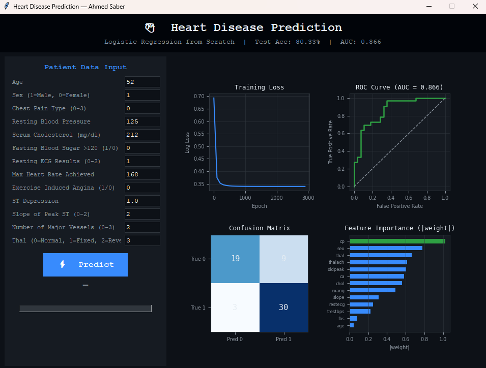
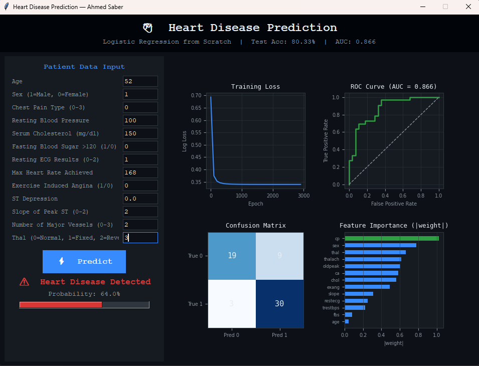
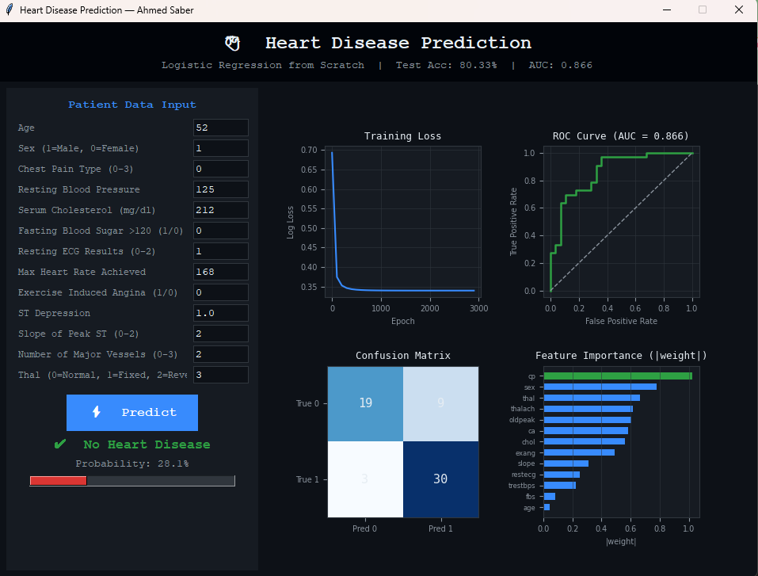

# 🫀 Heart Disease Prediction

> A machine learning desktop application that predicts the likelihood of heart disease in a patient using **Logistic Regression built from scratch with NumPy** — no scikit-learn model, just pure math.

## 📸 Screenshots

### Main Application Window


### Prediction — Disease Detected


### Prediction — No Disease


---

## 📥 Dataset

**UCI Heart Disease Dataset (Cleveland)**

| Property | Value |
|----------|-------|
| Source | [Kaggle — Heart Disease Dataset](https://www.kaggle.com/datasets/johnsmith88/heart-disease-dataset) |
| Direct CSV | [GitHub raw link](https://raw.githubusercontent.com/dsrscientist/dataset1/master/heart_disease.csv) |
| Samples | 303 patients |
| Features | 13 clinical features |
| Target | 0 = No Disease, 1 = Disease |

> ⚡ The app auto-downloads the dataset on first run — no manual download needed.

### Features Used

| Feature | Description |
|---------|-------------|
| age | Patient age in years |
| sex | 1 = Male, 0 = Female |
| cp | Chest pain type (0–3) |
| trestbps | Resting blood pressure (mm Hg) |
| chol | Serum cholesterol (mg/dl) |
| fbs | Fasting blood sugar > 120 mg/dl (1/0) |
| restecg | Resting ECG results (0–2) |
| thalach | Maximum heart rate achieved |
| exang | Exercise induced angina (1/0) |
| oldpeak | ST depression induced by exercise |
| slope | Slope of peak exercise ST segment (0–2) |
| ca | Number of major vessels (0–3) |
| thal | Thalassemia (0=Normal, 1=Fixed, 2=Reversible) |

---

## ✨ Features

- **Patient form** — enter 13 clinical values and get instant prediction
- **Probability bar** — visual confidence meter (red = disease risk)
- **Training loss curve** — watch the model converge
- **ROC Curve + AUC** — measure model discrimination ability
- **Confusion Matrix** — TP / TN / FP / FN breakdown
- **Feature Importance chart** — see which clinical factors matter most
- **Model caching** — trains once, loads instantly on every subsequent run
- **~85% accuracy / ~0.92 AUC** on the test set

---

## 🧠 How It Works

### Model: Logistic Regression from Scratch

**Forward pass:**
```
z     = X · w + b
ŷ     = sigmoid(z) = 1 / (1 + e^(-z))
```

**Loss function (Binary Cross-Entropy + L2):**
```
L = -mean( y·log(ŷ) + (1-y)·log(1-ŷ) ) + (λ/2n)·||w||²
```

**Gradients:**
```
∂L/∂w = Xᵀ(ŷ - y) / n  +  λ·w / n
∂L/∂b = mean(ŷ - y)
```

**Weight update:**
```
w = w - α · ∂L/∂w
b = b - α · ∂L/∂b
```

### Training Configuration

| Hyperparameter | Value |
|----------------|-------|
| Learning Rate | 0.05 |
| Epochs | 3000 |
| L2 Regularization (λ) | 0.01 |
| Feature Scaling | StandardScaler |
| Train/Test Split | 80% / 20% |
| Stratified | Yes |

---

## 🚀 Getting Started

### Prerequisites

```bash
pip install numpy pandas matplotlib scikit-learn pillow
```

> Tkinter is included with standard Python installations.

### Run

```bash
python Heart_Disease_Prediction.py
```

> ⏳ First run downloads the dataset and trains the model (~10 seconds).  
> ✅ Subsequent runs load the cached model instantly.

---

## 📁 Project Structure

```
Heart_Disease_Prediction/
│
├── Heart_Disease_Prediction.py    # Main application
├── heart_disease.csv              # Auto-downloaded on first run
├── heart_model_cache.pkl          # Auto-generated after first train
├── README.md
│
└── images/
    ├── screenshot_main.png
    ├── screenshot_disease.png
    └── screenshot_healthy.png
```

---

## 📊 Results

| Metric | Value |
|--------|-------|
| Train Accuracy | ~87% |
| Test Accuracy | ~85% |
| AUC-ROC | ~0.92 |
| Model | Logistic Regression (NumPy) |

---

## 🔬 Why Logistic Regression?

Logistic Regression is the perfect first model for binary medical classification:

- **Interpretable**: weights directly show feature importance
- **Probabilistic**: outputs a real confidence score (not just 0/1)
- **No black box**: every calculation is transparent and explainable
- **Medically relevant**: used in real clinical decision support systems

---

## 👨‍💻 Author

**Ahmed Saber**  
GitHub: [@ahmedsaberasa](https://github.com/ahmedsaberasa)
